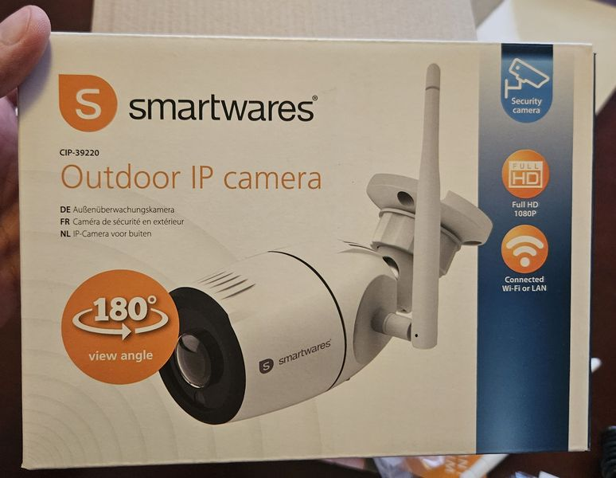
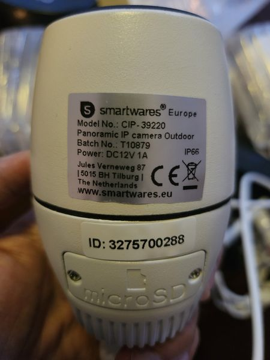
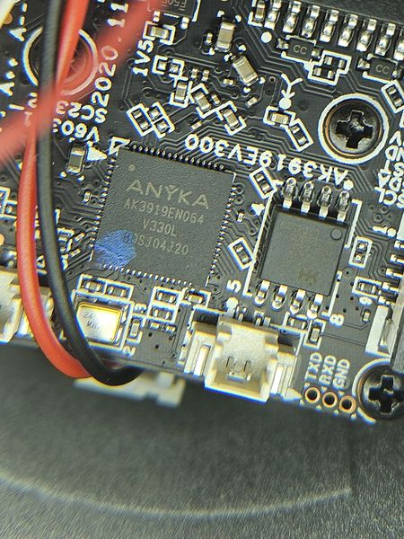
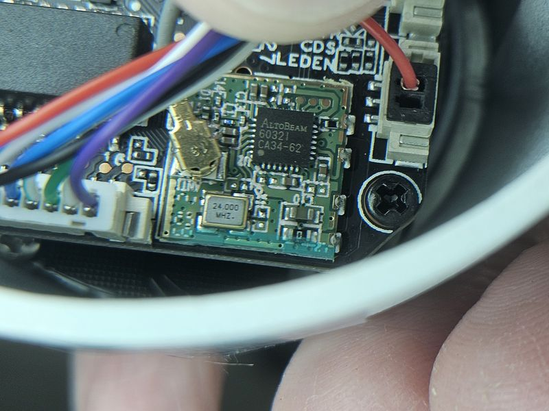

# Smartwares Camera CIP 39220 SDHack

This is a relatively cheap camera. My initial goal was to flash it with OpenIPC but unfortunately the Anyka SoC is not supported.
Still, I managed to get root access doing a sideload attack via the SD card slot.

More details can be found on this dedicated [repository](https://github.com/cat101/Smartwares-CIP-39220-SDHack)

 
 
 

