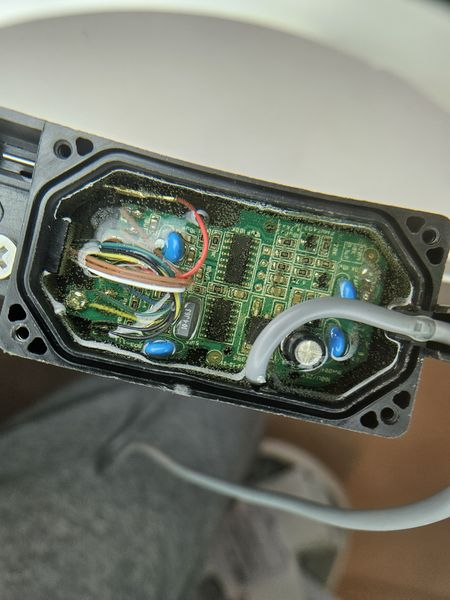
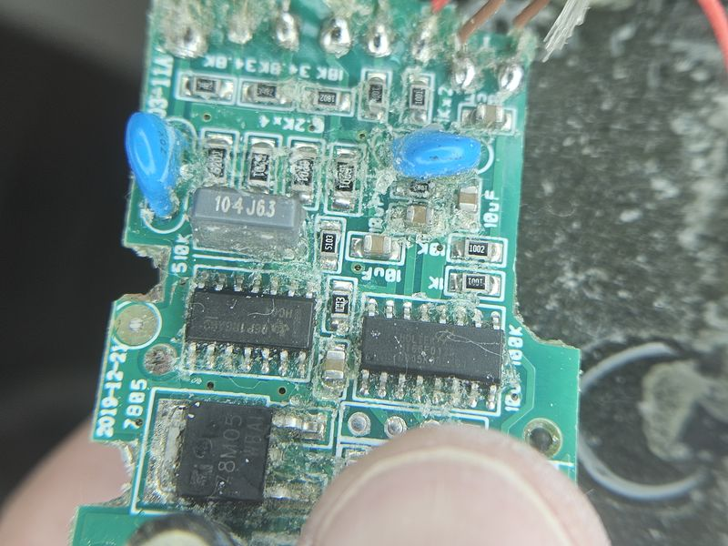

# Reversing a Solar Water Heater Sensor - B03 (2025)

The B03 is a temperature and level sensor for solar water heaters. It is used by the SR501 solar water heater controller. Although it looks the same as the GHBO1 used on the SR500, it is a different model. Some of the key differences are:

- The B03 use RS232 as the communication protocol. 
- It can measure 1/10 of a degree Celsius.
- It has an overflow sensor.
- More differences can be seen on [this article]({{ site.github.repository_url }}/tree/master/docs/{{ page.path | remove: '.md' | remove: '/index' }}/Exploration/SR500 vs SR501.pdf)

## Exploring the sensor module

{: width="50%"}
{: width="50%"}

From the PCB view we can see:
- A [Holtek HT66F017]({{ site.github.repository_url }}/tree/master/docs/{{ page.path | remove: '.md' | remove: '/index' }}/Exploration/HT66-68F016_16R_17_17Rv170.pdf) CPU which among other features it has 4 12bit ADCs
- A 7805 voltage regulator
- What it seems to be a resistor ladder for the level sensor

Initial wiring confirm that the red and black wires are power (12V) and the white wire is the data output. As in the SR500 sensor the white wire is the data output. Its voltage matches the supply voltage (i.e. if VCC=5V then it behaves like TTL, but if VCC=12 volts then the data voltage is 12V).

## Analyzing the comm protocol

I used an oscilloscope to analyze the communication protocol. The sensor sends 3 small packets and then a long one. The following image shows the long packet.

_resized.jpg){: width="50%"}

After some analysis I managed to determine that it was standard inverted serial communication at 4800 bps with 8 data bits, no parity and 1 stop bit.

The next step was to create to power the sensor with 5V and create a TTL inverter on a breadboard to start collecting data.

This is how the data looks like on a terminal:

```
00 01 88 02 04 DD 0B EC 02 04 DD 0B EC 02 04 DD 0B EC 02 04 DD 0B EC 02 09 DD 0B 92 00 04 
00 01 87 02 04 DC 0B EB 02 04 DC 0B EB 02 04 DD 0B EC 02 04 DD 0B EC 02 09 DD 0B 92 00 04 
00 01 88 02 04 DD 0B EC 02 04 DD 0B EC 02 04 DD 0B EC 02 04 DD 0B EC 02 09 DD 0B 92 00 04 
00 01 88 02 04 DD 0B EC 02 04 DD 0B EC 02 04 DD 0B EC 02 04 DD 0B EC 02 09 DD 0B 92 00 04 
```

After a lot of work I managed to interpret each byte in the sequence as follows:

```
00 01 02 03 04 T3 T2 T1 08 09 T3 T2 T1 13 14 T3 T2 T1 18 19 T3 T2 T1 23 24 T3 T2 27 L2 L1
```

There seems to be three types of packets based on their prefix
1. `00 01` Unknown type
2. `02 04` Full temperature read
3. `02 09` Partial temperature read and water level read

The temperature is encoded in the T1, T2 and T3 bytes. The temperature reading is the raw input form the ADC and is calculated as follows `t = ((unsigned int)T1 << 8) | T2;`. Unfortunately, in order to obtain the temperature in Celsius we need to apply a logarithmic calibration curve (see the [sample code]({{ site.github.repository_url }}/tree/master/docs/{{ page.path | remove: '.md' | remove: '/index' }}/example/WaterHeaterSensor.cpp)). T3 is a validation byte computed as `T3 = (T1 + T2 + 4) & 0xFF`. 

The water level is encoded in the L1 and L2 bytes. The level is calculated as `t = (100U*(((unsigned int)L1 << 8) + L2))/450U;`. This gives a non linear value between 0 and 100.

A complete code for decoding the sensor data can be found in the **[example directory]({{ site.github.repository_url }}/tree/master/docs/{{ page.path | remove: '.md' | remove: '/index' }}/example)** on GitHub. The code reads the sensor data and prints it to the serial monitor.
